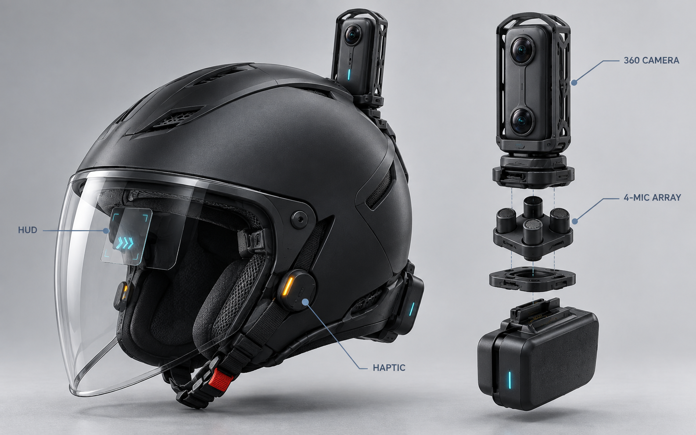
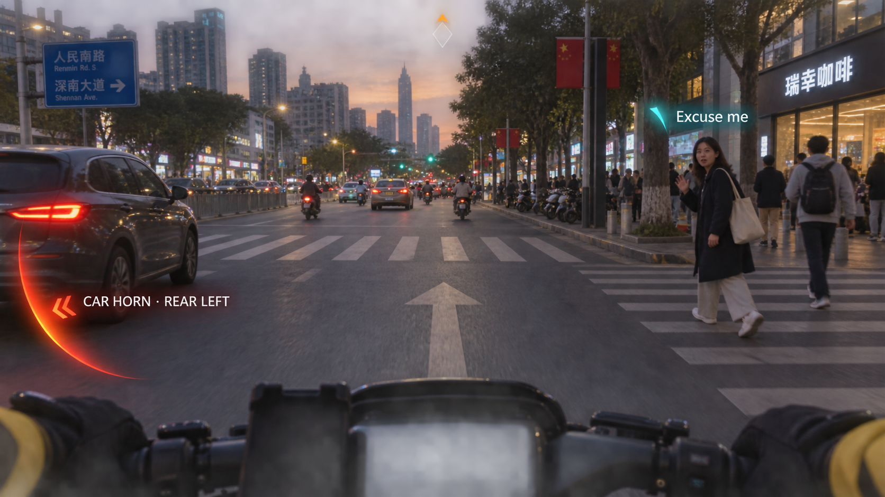
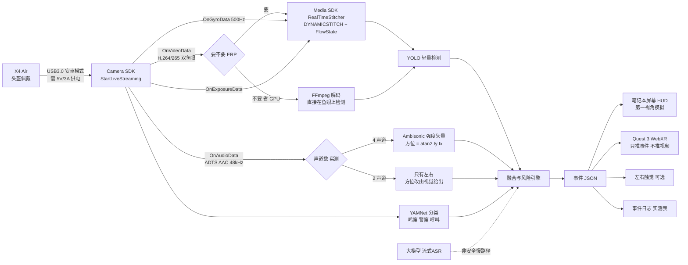

# Bold Vision 360——把环境声音变成可见的视觉方向

> 2026-09-23 实施更新：X4 Air 内置麦克风在强降风噪模式输出同源双声道；切换全景声后已获得 48kHz 四声道，完成四方位与独立转动验证。已复查首轮右、后方约 32–33° 偏差并收紧为逐方位门槛；当前更新标定集平均误差 9.8°、最大 16.0°，完整现场精度仍未验收，详见 [误差复查](reports/spatial-accuracy-review.md)。降噪与定位路径见 [降噪设计](docs/audio-noise-design.md)，下文未实测的性能设想不能视为已经交付。

> 面向听障/骑手的 360° 多模态安全辅助系统。一台 X4 Air 同时提供 360° 画面、Ambisonic 空间音频和 IMU 姿态（三者共用同一时钟基准与同一坐标系），边缘 HUD 与左右触觉把“什么声音、从哪来、是否危险”在一秒内告诉用户。





## 1. 产品判断

### 为什么值得做

- 与命题高度吻合：不是让用户操作相机，而是让相机理解环境并主动服务人。
- 全景相机解决普通眼镜相机看不到身后与侧后的问题；X4 Air 的实时预览与 IMU 数据能支撑 360° 视觉和方向稳定。
- 听障用户确实需要“声源是什么 + 在哪里”。既有研究已验证手表声音识别、AR 字幕和头显声源方向提示的价值。
- 演示性强：让评委戴上设备，背后鸣笛，HUD 在正确方位亮起，3 秒即可理解产品。

### 当前想法必须修正的四点

1. **目标人群过宽。** 听障人士、骑手和工人不能同时做成首发产品。比赛主场景锁定“听障/骑手”，工地模式放在扩展页。
2. **持续环形声纹会造成视觉噪声。** 环只作为空间坐标，平时不可见；事件出现时只亮对应扇区，并显示类别与紧迫度。
3. **一阶 Ambisonic 和平面阵列都不能可靠判断上下。** MVP 只承诺水平 8 方位（这与一阶 Ambisonic 主瓣宽 ±45–60° 的物理极限正好吻合，不是妥协）。上下信息仅在视觉确认或非共面阵列置信度足够时显示为顶部/底部小菱形，不做连续三维三棱锥。
4. **安全判断不能依赖大模型或网络。** 本地小模型负责低延迟危险告警；大模型只负责字幕、语义解释和赛后摘要。

## 2. 一句话方案与首发场景

**Bold Vision 360 = 360° 视觉 + 空间音频 + 本地 AI，将不可见的声音转译成方向、类别、风险和行动提示。**

首发演示只讲一个故事：

1. 骑手正常前行，HUD 中央 70% 无覆盖。
2. 左后方车辆鸣笛，X4 Air 自带麦克风估计方位；同一台相机在相同角度发现接近车辆。
3. 左后边缘出现红橙扇区和“汽车鸣笛 · 左后”，左侧触觉短振两次。
4. 用户回头或车辆风险解除后，提示自动淡出。
5. 前右方有人说“师傅，小心”，以青色方向箭头和短字幕出现，但优先级低于车辆危险。

## 3. 交互规范

### 信息编码

| 维度 | 表达方式 | 规则 |
|---|---|---|
| 方向 | 视野边缘对应位置 | 水平分 8 个扇区；不在中央画雷达 |
| 类别 | 图标 + 最多 8 个中文字符 | 如“鸣笛”“警笛”“有人呼叫” |
| 紧迫度 | 颜色 + 形状 + 动效 | 红橙=立即处理，琥珀=注意，青色=交流；不能只靠颜色 |
| 置信度 | 透明度 | 低置信度不显示百分比，不打扰用户 |
| 左右触觉 | 左/右太阳穴振动 | 危险声才触发；后方为两次短振，正侧方为一次长振 |
| 上下方向 | 顶部/底部小菱形 | 仅置信度高时出现；MVP 可不启用 |

### 告警优先级

1. **P0 立即危险：** 汽车鸣笛、警笛、倒车蜂鸣、火警；红橙 + 触觉，保持 1.2 秒，风险未解除可续期。
2. **P1 需要注意：** 自行车铃、施工敲击、有人大声喊；琥珀，无连续震动。
3. **P2 交流：** 对话与关键词字幕；青色，危险事件出现时立即让位。

加入 300ms 方位平滑、15° 滞回和 1.2 秒视觉保持，避免方向在相邻扇区来回抖动。

## 4. 可实现的系统架构

> 已按 2026-09-22 核实的 SDK 事实重写。声音和画面**出自同一台相机、同一根 USB 线、同一次 `StartLiveStreaming` 调用**，独立麦克风阵列降级为待验证的备选分支。



### 4.1 相机接入（已核实，唯一可行路径）

桌面端 SDK **只走 USB**（Wi-Fi/蓝牙仅 Android/iOS SDK；蓝牙任何情况都不支持预览）。**X4 Air 不支持 UVC 网络摄像头模式**（X2/X3/X4/X5 支持，X4 Air 和 ONE X 不支持），所以没有"当普通摄像头用 OpenCV 打开"这条捷径。

1. USB 线连相机 → 相机屏幕弹模式选择 → 选「**安卓模式**」。**切换需满足 5V/3A**，笔记本 USB 口常供不足 → 用带独立供电的 USB 3.0 Hub。
2. `DeviceDiscovery::GetAvailableDevices()` → `Camera(list[0].info)` → `Open()` → `SetStreamDelegate(delegate)`。
3. **`StartLiveStreaming(param)`** —— 画面和音频出自同一次调用，不用维护两条管线。
4. `StreamDelegate` 四个回调：`OnVideoData`（H.264/H.265 裸流；1920×960 即左右并排两个 960×960 鱼眼，**未拼接**；`GetVideoEncodeType()` 查编码）、`OnAudioData`、`OnGyroData`（10Hz 回调 × 每组 50 点 = **500Hz**，含三轴加速度+三轴陀螺）、`OnExposureData`（500Hz）。**四者共用「相机启动后时间」同一时钟基准**，帧↔IMU 同步可解，不是玄学。`SetVideoDelayMs()` 用于手动微调视频与陀螺仪对齐；`PreviewParam` 里的 `delay_timestamp` / `gyro_range` / `sweep_time` 可作起点。

### 4.2 拿到音频的完整咒语（最容易踩空的一步）

赛事指南写「音频数据只有调到'直播模式'下才有」，其真实含义在 `LiveStreamParam` 注释和官方 demo 里：**必须先切相机子模式**，光设音频字段拿不到音频（官方在 X5/X6 上实测确认）。

```cpp
// 1) 先切「APP直播」子模式 VIDEO_LIVEVIEW = 12
//    固件仅在该模式下才向预览流下发音频
cam->SetVideoSubMode(ins_camera::SubVideoMode::VIDEO_LIVEVIEW);

// 2) 起流：两个开关都要打开
ins_camera::LiveStreamParam param;
param.video_resolution     = ins_camera::VideoResolution::RES_1920_960P30;
param.lrv_video_resulution = ins_camera::VideoResolution::RES_1920_960P30;
param.video_bitrate        = 1024 * 1024 / 2;
param.enable_audio         = true;   // 结构体默认已是 true
param.is_for_live          = true;   // ← 默认 false，漏了就没声音
param.using_lrv            = false;
cam->StartLiveStreaming(param);

// 3) 停止后务必切回，否则相机留在直播子模式
cam->StopLiveStreaming();
cam->SetVideoSubMode(ins_camera::SubVideoMode::VIDEO_NORMAL);
```

音频是 **ADTS AAC 裸流，48000 Hz / 128000 bps**，`ffplay` 可直接播。`OnAudioData` 签名不含声道信息，落盘后 `ffprobe -show_streams dump.aac | grep channels` 才知道几声道。

**零代码验证法**：直接跑 `CameraSDKDemo.exe` → 主菜单 `6`（实时预览）→ `5`（开始预览(带音频)），工作目录生成 `preview_audio.aac` + `preview_stream_0.h264`。demo 用「懒打开文件」写法，**文件没生成就说明相机根本没发音频**，可区分「没发」与「发了没写盘」。

### 4.3 声道数决定音频架构（开工 3 小时内必须出结论）

X4 Air **原生支持 Ambisonic（全景声）**，官方确认「仅 X6、X5、X4 Air 支持」。但「全景声」标注「仅支持 360° 视频录制」，**直播模式下是 4 声道还是 2 声道无任何文档说明**，只能实测。同时注意：**桌面 Camera SDK 没有设置收音模式的接口**，全景声/立体声只能在相机屏幕上手动切。

| 实测结果 | 走法 |
|---|---|
| **4 声道** | 用 X4 Air 自带麦克风，**不买 USB 阵列**。省钱之外更重要的是省掉「阵列↔相机」外参标定——隐藏的大坑，演示当天最容易崩 |
| **2 声道** | 只有左右（ILD/ITD）且有前后混淆。**不要急着买阵列**，改成「音频只做触发+分类，方位交给 360° 视觉」——反而更稳，也是更好讲的融合故事 |

一阶 Ambisonic (W,X,Y,Z) 的方位是解析解，不需要搜索：

```
每频带 k：Ix = Re{W*·X},  Iy = Re{W*·Y},  Iz = Re{W*·Z}
按能量加权跨频带平均：
  方位角 = atan2(ΣIy, ΣIx)
  仰角   = atan2(ΣIz, sqrt(ΣIx² + ΣIy²))
  置信度 = |I| / 总能量      ← 声场越扩散越低
```

**置信度是白送的**：风噪、交通轰鸣这类扩散场自然给出低值，直接压掉误报，正好喂「置信度→透明度」和「安静道路误报 ≤1次/5分钟」两个指标。一阶 Ambisonic 主瓣宽约 ±45–60°，**与「水平 8 扇区（每 45°）」几乎完全匹配**——限 8 方位不是妥协，是物理上正确的选择。

**同时必须测：Ambisonic 是体坐标系还是世界系。** 固定声源不动、转动相机，看算出的方位角是否跟着变。跟着变 = 体坐标系 = 头戴 HUD 的理想情况（IMU 零工作量）；不变 = 固件已用陀螺仪补偿，需用 `OnGyroData` 反算头部朝向再减掉。

**声道轴向约定也要实测**：把喇叭放在 0°/90°/180°/270°、1.5m 处各录一段，对每种 W/X/Y/Z 候选排列算方位角，取一致的那个。约 30 分钟。

**收音模式与降噪对照测试**：分别验证强降风噪、弱降风噪、立体声、全景声的 SDK 输出。机身处理可能改变空间线索，但当前“两路相同”的原因尚未证实。保留 SDK 源 PCM 用于录制与定位，软件降噪只作用于分类副本；机身模式和软件处理分别比较。详见 [降噪设计](docs/audio-noise-design.md)。

**风噪是音频路径最大的物理风险，大于算法风险。** 骑行时麦克风口的湍流声压会淹没有用信号（官方建议收音距离 ≤3m）。演示就在室内静止或慢速做；答辩直说「高速风噪是待解问题」——这是可信的工程判断，不是弱点。强度矢量的置信度天然会压低风噪主导的帧，把这点讲成设计特性。

### 4.4 视觉链路：能不拼接就不拼接

- **X4 Air 的视频不能机内拼接**（X6/X5/X4/X4 Air 仅照片可机内拼接），视频必须走 Media SDK。所以 `EnableInCameraStitching` 对你的视频链路没用。
- Media SDK 的 `RealTimeStitcher` **明确支持 X4 Air**，输出 **RGBA**，回调里一行就是 `cv::Mat`，OpenCV/YOLO 无缝接。
- 实时拼接用 **`ins::STITCH_TYPE::DYNAMICSTITCH`**（官方 demo 注释：速度与质量平衡最好；`TEMPLATE` 更快但质量低；`AIFLOW` 质量最高但需 GPU/模型且延迟大）。注意别和离线 `MediaSDKTest` 的 CLI 参数名（optflow/dynamicstitch/aistitch）混淆。
- **开 `EnableFlowState(true)`**——它消费 `OnGyroData` 做防抖。头戴转头时画面糊掉是 YOLO 漏检的头号原因，这是官方现成的解法。
- **但不要开 `EnableDirectionLock(true)`。** 头文件注释：「lock the horizon/direction during real-time stitching. Requires FlowState to be enabled first」。开了它 ERP 输出方向会被锁到世界系，**转头时画面内容会横向滑动**，你就必须再从陀螺仪把头部偏航加回去才能算出头相对方位。本项目 HUD 是头相对的、音频方位（若是体坐标系）也是头相对的，所以**保持默认关闭**，让 ERP 的图像中心始终对应「相机正前方 = 用户正前方」。FlowState 管抖动，DirectionLock 管朝向——只要前者。
- `CameraInfo` 还有两个 demo **没设**的同步字段：`gyro_timestamp`（首个陀螺样本时间戳）和 `sweep_timestamp`（卷帘快门校正用）。分别对应 `PreviewParam` 的 `delay_timestamp` 和 `sweep_time`。**先照 demo 不设**；如果发现画面和防抖对不上（表现为快速转头时边缘拉伸或残影），再把这两个填上试。
- 实时拼接回调的 `format` 遵循 **FFmpeg `AVPixelFormat` 约定**（demo 直接按 RGBA 处理，即 `AV_PIX_FMT_RGBA=26`）。稳妥起见在回调里断言一次 `format==26`，别默默按 RGBA 解释一个 YUV 平面。
- 官方 demo 用 `SetOutputSize(960, 480)`。检测只要 640×640，**不需要 3840×1920**；不设置时默认等于预览分辨率，官方明说降低分辨率可提升帧率。
- `calibration_offsets` **不需要签保密协议**——直接从 `cam->GetPreviewParam()` 的 `GetCalibrationCount()`/`GetCalibration(i)` 与 `GetCropSrcWidth/Height()`、`GetCropDstWidth/Height()`、`GetCropOffsetX/Y()` 取。NDA 版 Metadata SDK（联系 xuyongbo@insta360.com）只在你要自己把图像和激光雷达点云对齐时才需要。
- 初始化顺序：`ins::InitEnv()` 必须最先调用，然后 `ins::SetModelFileRootDir(exe目录 + "models\\")`（不设会静默降级）。
- 起停顺序有讲究：先 `StartLiveStreaming` 再 `StartStitch`（反了会丢首批帧）；停止时先停显示线程 → `destroyWindow` → `StopLiveStreaming` → `CancelStitch`（先停相机会让显示线程永久阻塞在条件变量上）。
- 回调里的帧缓冲 **SDK 返回后即复用**，必须 `.clone()` 再交给下游，否则撕裂。RGBA→BGRA 才能给 OpenCV 显示。回调里不要做耗时操作。
- `GyroData` 在 CameraSDK 与 MediaSDK 之间**二进制兼容**，可直接 `memcpy`。

**Media SDK 必须有 GPU**（赛事指南表格原文）。无 GPU 或 CUDA 不兼容时的降级：`using_lrv=true`（demo 注释称降到 1024×512）+ 自己 FFmpeg 解码双鱼眼，**直接在鱼眼图上跑检测，完全跳过拼接**。YOLO 本来只要 640×640，不一定需要 ERP。离线 `MediaSDKTest` 另有 `-disable_cuda`（走 CPU）和 `-image_processing_accel cpu`（Vulkan 报错时用）。

### 4.5 数据与融合规则

- 音频事件得到 `(类别, 方位角, 置信度, 时间戳)`；视觉目标得到 `(类别, 球面方位角, 运动方向, 时间戳)`。
- 当音频和视觉角度差小于 25°、时间差小于 500ms 时建立关联。
- 建议风险分：`0.45×声音置信度 + 0.35×视听方向一致性 + 0.20×接近趋势/TTC`。TTC 可用影石研究院开源的 **DAP 全景深度估计**（输入单张 ERP → 深度）直接算，用官方开源模型还是评审加分项。
- **IMU 的用途在头戴场景下与原稿相反**：相机跟着头转，所以 **HUD 做「头相对方位」，不做 world-lock**，不需要 AprilTag 标定外参。转头时环本来就该跟着头转。IMU 只有两个正确用途：喂 FlowState 防抖、在多帧间平滑方位抖动（300ms 平滑 + 15° 滞回）。
- 桌面 SDK 是 USB 连接，**相机不占用 Wi-Fi**，笔记本 Wi-Fi 保持正常、能同时连局域网给 Quest 3 推事件。（若改走 Android SDK 的 Wi-Fi 路径，笔记本得加入相机热点从而失去网络——隐蔽的架构陷阱。）
- **放弃 RTMP 方案**：X4 Air 确实支持 RTMP 自定义推流（全景/平面均可），但必须经手机 Insta360 App 中转，延迟 1–3 秒，直接爆掉 ≤900ms 的 P95 指标。只能当演示备份。
- OSC 协议（WiFi，`192.168.42.1`，不限平台、无需 NDA）**没有预览流**，只有拍照/录像/列文件/删文件/参数读写。可用它在无 SDK 时自动下载录制素材，不能用于实时。

### 模型与工程选型

| 模块 | 48 小时推荐 | 后续升级 |
|---|---|---|
| 声源方位 | X4 Air 自带 Ambisonic + 强度矢量法（若实测为 4 声道）；否则 GCC-PHAT 兜底。中值滤波 + 15° 滞回 | ODAS / SRP-PHAT，多声源跟踪，非共面阵列做垂直方向 |
| 声音分类 | YAMNet/TFLite（用 W 声道或立体声下混成单声道，与方位估计互不干扰），补录少量赛事现场样本 | BEATs/PANNs 微调与个性化声音 |
| 视觉检测 | YOLOv8n 同级轻量模型。优先直接跑双鱼眼或用 `SetOutputSize(960,480)` 的 ERP，不做 4 立方体视面 | 全景原生检测、DAP 深度估计与 TTC |
| 中文语音 | 流式 ASR，只用于呼叫/字幕（P2，不进安全环路） | 说话人识别与个性词库 |
| 大模型 | 仅解释“刚才发生了什么” | 多模态场景理解；不进入安全闭环 |
| 输出 | **主交付：笔记本屏幕双栏第一视角模拟**；Quest 3 WebXR 为升级项 | 真正光学透视 AR 眼镜或量产头盔 HUD |
| 取流 | 桌面 Camera SDK（C++），USB + `StartLiveStreaming` | Jetson AArch64 版做背包式可穿戴 |

## 5. 硬件选型与设备分工

### 黑客松 MVP

- **主相机：X4 Air（头盔佩戴）。** 一台设备同时负责 360° 实时画面、Ambisonic 空间音频、IMU 姿态，且三者共用同一时钟基准与同一坐标系。**这是本项目最强的技术论点**：分体设备做不到，要额外标定且会漂。
- **麦克风：优先用 X4 Air 自带的。** 仅当 §4.3 实测确认直播模式只输出 2 声道、且"音频触发+视觉定位"的降级方案效果不够时，才买现成 4/6 麦 USB 环形阵列。不要在比赛现场从零焊非共面阵列。
- **必买/必带的小件（便宜但缺了就翻车）：带独立供电的 USB 3.0 Hub**（「安卓模式」切换需 5V/3A）、**2–3m USB 3.0 线**（头戴相机 + 桌上笔记本的演示布局需要，被动线超 3m 会掉速）、相机备用电池、microSD（UHS-I V30 以上）。
- **计算：带 NVIDIA GPU 的 Windows/Linux 笔记本。** Media SDK 必须有 GPU。⚠️ 随包只带了 **CUDA 10.x 运行库**（`cudart64_102.dll`），主要覆盖到 Turing（CC 7.5）；RTX 30/40 系（CC 8.6/8.9）能否跑取决于是否内嵌 PTX 供驱动 JIT，**必须在第一小时用 `RealTimeStitcherSDKTest.exe` 实测**。包里另有 `DirectML.dll` + `onnxruntime.dll`，AI 部分可能走 DirectML 兜底（任意 DX12 显卡可用）。
- **开发机注意：SDK 没有 macOS 版。** 手上这台 Mac 只能用来写代码、跑离线音频管线（Python/ffmpeg）、做 HUD 前端；**编译和连相机必须在 Windows/Linux 笔记本上**。
- **显示：主交付是笔记本屏幕的双栏第一视角模拟**（左栏实时 ERP + 检测框，右栏第一视角 + 边缘 8 扇区光环）。Quest 3 为升级项，走 WebXR `immersive-ar` + passthrough，**只推事件 JSON 不推视频**。团队没有 AR 眼镜，不要把它放进关键路径。演示当天注意：戴 Quest 3 的人看不见笔记本屏幕，**两个都要有**——头显给体验者，笔记本屏幕给评委和观众。
- **触觉：两个 ESP32 控制的硬币马达，左右各一个。** 由主程序通过 BLE/串口触发。**48 小时内降级为加分项**——它是独立工作流（硬件、通信、佩戴），不该挤占音频方向和演示稳定性。
- **GO 3S：不需要。** 官方明确 ACE 和 GO 系列无法通过 SDK 拿到音频数据，进不了主安全闭环。

### 已下载的 SDK 资产（`SDKs/`）

| 包 | 用途 |
|---|---|
| `CameraSDK-2.2.0-...-win64/` | **主力**。已解压，含 `bin/CameraSDKDemo.exe`（可零代码验证音频）、`include/`、`example/CameraSDKDemo/preview.h`（带音频预览的完整参考实现）、`bin/jsons/camera_conf_Insta360_X4_Air.json` |
| `MediaSDK-3.1.7-...-win64/` | **主力**。含 `bin/RealTimeStitcherSDKTest.exe`（可零代码验证实时拼接）、`example/realtime_stitcher_demo.cc`、`bin/models/`（含 X4 Air 专用 `defringe_air_hr_dynamic_*.ins`） |
| `CameraSDK-2.2.0-...-linux-x86_64.tar` | Linux 笔记本备选 |
| `CameraSDK-2.1.8-...-jetson-linux-9.3.0...tar` | 以后做 Jetson 背包式可穿戴 |
| `CameraSDK-...-gcc-arm-...-aarch64...tar` | ARM64 交叉编译 |
| `InsMetaDataSDK-2.0.2-linux64` | 相机内参。实时拼接**用不到**（标定从 `GetPreviewParam()` 直接拿）；只在要和点云对齐时才需要 |
| `AndroidSDKDemo/`（含 278MB 预编译 APK） | 备选。走手机 + USB/Wi-Fi，可便携但算力和拼接更吃力 |

### ⚠️ 编译环境的三个缺口（会白烧 1–2 小时，提前备料）

包里**没有任何构建脚本**（无 `CMakeLists.txt`、无 `.sln`、无 `.vcxproj`、无 README），要自己搭：

1. **OpenCV 只给了 DLL，没给头文件和 `.lib`。** MediaSDK 的 `bin/` 里有全套 `opencv_*470.dll`，而 `realtime_stitcher_demo.cc` 第一行就 `#include <opencv2/opencv.hpp>`。**必须自己装 OpenCV 4.7.0 的 Windows 预编译包**（含 `include/` 和 `lib/`），且版本要对上 470，否则运行时 DLL 冲突。
2. **MediaSDK 的 `include/` 只有 3 个头**（`ins_common.h`、`ins_realtime_stitcher.h`、`ins_stitcher.h`），**没有 CameraSDK 头**。而 demo 同时要 `#include <camera/camera.h>`。所以编译实时拼接程序时，**include 路径要同时挂两个 SDK**：`CameraSDK.../include` + `MediaSDK.../include/stitcher`；链接 `CameraSDK.lib` + `MediaSDK.lib`。
3. **运行时要能找到一堆 DLL。** 最省事的做法：**把自己编出来的 exe 直接丢进 `MediaSDK.../bin/` 里跑**（那里已经有 `MediaSDK.dll`、`CameraSDK.dll`、CUDA 10 全套、OpenCV 470 全套、`DirectML.dll`、`onnxruntime.dll`、`MNN.dll` 和 `models/`），省掉配 PATH 和环境变量。`models/` 必须和 exe 同级，否则 `SetModelFileRootDir(exeDir+"models\\")` 找不到模型会**静默降级**。

工具链：VS 2019/2022（MSVC v142/v143）+ CMake。两个 `.lib` 都是 win64，**平台必须选 x64**，别用默认的 Win32。

### 量产方向

- X4 Air 级全景视觉与 MEMS 阵列共轴封装，减少视觉/音频坐标标定误差。若实测确认 X4 Air 自带 Ambisonic 已够用，量产可直接沿用相机内置阵列，省掉独立麦克风模组。
- 计算单元与电池后置，平衡头盔前后重量；摄像与麦克风模块快拆。桌面 SDK 已有 **Jetson（Linux AArch64）版本**，背包式计算单元有官方支持路径，不是 PPT。
- 左右触觉内置于头盔衬垫；HUD 只显示边缘事件。
- X4 Air 官方支持外接摩托头盔蓝牙耳机（SENA、Cardo、Vimoto、Airide、ASMAX、乐行），量产可复用这条链路做提示音或对讲，不必另做通信模组。

## 6. 48 小时执行排期

**核心排期原则：离线优先 + 数据源可替换。** 把「帧/音频来源」抽象成一个接口，让**离线 INSV 文件**和**实时流**可以互换。这样即使 SDK、供电或 GPU 出问题，你手上也已经有一个能演示、有实测数据支撑的作品。这是整个项目最重要的降风险动作。

### 第 0–4 小时：拆到半小时粒度，因为这 4 小时决定后面 44 小时走哪条路

| 时段 | 动作 | 过关标准 |
|---|---|---|
| 0:00–0:30 | **先用相机录一批全景声 INSV 素材**（收音模式在机身上手动设为「全景声」；8 方位 × 3 类声音）。同时在笔记本上装好编译环境 | 素材到手 → 后续音频开发**永不阻塞** |
| 0:30–1:00 | 供电 Hub + USB 线 + 相机切「安卓模式」 | 相机屏幕显示切换成功，不掉回 U 盘模式 |
| 1:00–1:30 | 跑 `CameraSDKDemo.exe`，看能否发现设备 | 打印出序列号、机型 `Insta360 X4 Air`、固件版本、SDK 版本 |
| 1:30–2:00 | Demo 主菜单 `6`（实时预览）→ `1`（开始预览） | 工作目录生成 `preview_stream_0.h264`，`ffplay` 能看到双鱼眼画面 |
| 2:00–2:30 | Demo 主菜单 `6` → **`5`（开始预览(带音频)）** | 生成 `preview_audio.aac`。**文件没生成 = 相机没发音频**（检查是否切了 `VIDEO_LIVEVIEW`） |
| 2:30–3:00 | `ffprobe -show_streams preview_audio.aac` | **知道声道数是 4 还是 2 → 决定要不要买麦克风阵列**（§4.3 岔路口） |
| 3:00–3:30 | 固定声源 + 转动相机，复测方位角 | **知道 Ambisonic 是体坐标系还是世界系 → 决定 IMU 那部分要不要写代码** |
| 3:30–4:00 | 跑 `RealTimeStitcherSDKTest.exe` | 弹出 OpenCV 窗口显示拼接好的全景 → **同时验证了 CUDA 10.x 在你的显卡上能不能跑** |

> 2:30 和 3:00 这两个结论必须写进群里同步，它们直接改变 B 和 C 两人后面 20 小时的工作内容。

### 4–48 小时

| 时间 | 目标 | 交付物 |
|---|---|---|
| 4–10h | **离线**做出声音方向 | 用第 0 小时录的 INSV 跑通「解码→方位→8 扇区」；单声源角误差统计 |
| 10–16h | 做出声音类别 | 鸣笛、警笛、呼叫三类；置信度与去抖；300ms 平滑 + 15° 滞回 |
| 16–22h | 打通实时视觉 | 自研程序里 `StartLiveStreaming` + `OnVideoData` 解码；`RealTimeStitcher`(DYNAMICSTITCH + FlowState, 960×480) 出 `cv::Mat`；YOLO 车辆/行人检测 |
| 22–26h | **把离线源换成实时源** | 接口不变只换实现；确认端到端延迟 |
| 26–32h | 视听融合 | 音频角度与视觉目标关联（<25° 且 <500ms），输出统一事件 JSON |
| 32–38h | HUD | 笔记本双栏界面（左：ERP+检测框；右：第一视角+边缘光环）、优先级抢占。触觉为加分项 |
| 38–43h | 现场测试 | 8 方位 × 3 类声音 × 5 次，安静/交通噪声两条件，记录延迟/误差/漏报 |
| 43–48h | 演示与答辩 | 90 秒现场演示、3 分钟讲稿、失败降级视频 |

### 四人分工

- **A：相机链路。** USB/供电/安卓模式、`StartLiveStreaming`、`OnVideoData` 解码、`RealTimeStitcher`、`OnGyroData` 与 FlowState。**A 是单点依赖，0–4 小时必须由 A 亲自跑完并同步结论。**
- **B：音频。** 声道数与坐标系实测、Ambisonic 强度矢量（或 GCC-PHAT 兜底）、YAMNet 分类。**先在第 0 小时录好的 INSV 上离线开发**，不等 A。
- **C：视觉与融合。** YOLO 检测、视听关联、风险引擎、TTC（可用影石开源 DAP）。
- **D：HUD 与演示。** 事件 JSON 协议定义、笔记本双栏渲染、用户测试、答辩。**D 应在第 4 小时就定死事件 JSON 协议**，让 B/C 照着输出，避免后期返工。

三人队时，C 与 D 合并；不要牺牲音频方向和演示稳定性去做后台、账号、云端管理。

### Quest 3 升级项（仅在 32h 前完成主链路时才做，预算 4 小时）

笔记本跑完全部计算，只通过 WebSocket 推事件 JSON（`{类别, 方位角, 紧迫度, 置信度, 时间戳}`）；Quest 3 用 WebXR `immersive-ar` 进 passthrough，three.js 在用户周围 1.5m 处渲染扇区环。事件 JSON 只有几十字节，局域网延迟约 5ms，不影响 P95 指标。**不要把视频推给 Quest 3**——它自己有 passthrough，推视频只会增加延迟和失败面。

## 7. 可验收指标

比赛前至少输出一张实测表，而不是只说“有效”。

| 指标 | 通过线 | 冲刺线 |
|---|---:|---:|
| 危险声音召回率 | ≥85% | ≥92% |
| 水平方位中位误差 | ≤22.5° | ≤15° |
| 端到端 P95 延迟 | ≤900ms | ≤600ms |
| 安静道路误报 | ≤1 次/5 分钟 | ≤1 次/10 分钟 |
| 用户转向正确率 | ≥85% | ≥95% |
| HUD 中央无遮挡区域 | ≥70% | ≥80% |

测试最小集：8 个方向 × 3 类声音 × 5 次，安静/交通噪声两个条件；另外单独跑 10 分钟负样本。记录原始音频、预测角度、视觉目标、最终事件和时间戳，便于现场复盘。

## 8. 风险与降级

### 链路风险（按发生概率排序）

| 风险 | 影响 | 降级策略 |
|---|---|---|
| **忘记 `VIDEO_LIVEVIEW` / `is_for_live` → 静默无音频** | 整条音频路径拿不到数据，且没有任何报错 | 先跑 `CameraSDKDemo.exe → 6 → 5`，**`preview_audio.aac` 没生成就说明是相机没发**，不是代码写错。demo 的懒打开写法专门用于区分这两种情况 |
| **USB 供电不足 5V/3A → 切不到「安卓模式」** | 相机被识别成 U 盘，SDK 连不上 | 带独立供电的 USB 3.0 Hub；换线（细线压降大）；相机单独充满电再试。**这是第 0–4 小时最容易卡住的一步，卡住就跳过 SDK 直接录 INSV 走离线** |
| **CUDA 10.x 在新显卡上跑不起来**（随包只有 `cudart64_102.dll`，CC ≥8.6 依赖 PTX JIT） | Media SDK 拼接失效 | 三级降级：① `stitcher->SetSoftwareCodecUsage(false, true)` 改走 CPU 解码（头文件原文：enable software/CPU-based codec implementations）；② 包里另有 `DirectML.dll` + `onnxruntime.dll` + `MNN.dll` 可兜底 AI 推理；③ 拼接降级为 `using_lrv=true`（1024×512）+ **自己 FFmpeg 解码双鱼眼、直接在鱼眼图上跑 YOLO，完全跳过拼接**。检测只要 640×640，ERP 不是必需品 |
| **直播模式音频只有 2 声道** | 没有 Ambisonic，方位算不出来 | 音频退化为「触发器 + 分类器」，方位由 360° 视觉给出。**不要现场买麦克风阵列**——那会引入阵列↔相机外参标定这个新的失败面 |
| **风噪淹没信号**（骑行时麦克风口湍流） | 音频路径在真实场景失效 | 演示改室内静止/慢速；强度矢量置信度天然压低风噪主导的帧，讲成设计特性；答辩直说高速风噪是待解问题 |
| **智能降风噪破坏声道间相位** | 方位估计精度崩掉 | 收音模式手动切到「立体声」（官方称无降噪处理、高度还原现场），两种模式都实测对比 |
| **Ambisonic 是世界系而非体坐标系** | HUD 方位与头部朝向脱钩 | 用 `OnGyroData` 反算头部朝向再减掉。体坐标系反而是理想情况（IMU 零工作量） |
| **SDK 没有 macOS 版** | 开发机与相机机分离 | Mac 只做写代码、离线音频管线（Python/ffmpeg）、HUD 前端；编译与连相机全在 Windows/Linux 笔记本。**代码用 git 同步，不要靠拷贝** |
| **Media SDK 拼接延迟或掉帧** | 视觉链路卡住 | 降 `SetOutputSize`；改 `TEMPLATE`（更快、质量低）；或走上面的鱼眼直检路径 |
| 麦阵/相机在反射环境角度跳动 | 提示抖动 | 单声源演示、限 8 扇区、300ms 中值滤波与 15° 滞回 |
| 多声源同时出现 | 分类与方位错配 | 只显示最高风险事件，其他事件进入队列 |
| **团队没有 AR 眼镜** | 无法真机叠加 | 主交付改为**笔记本屏幕双栏第一视角模拟**；Quest 3 WebXR `immersive-ar` + passthrough 作为升级项（仅在 32h 前主链路完成时做，预算 4 小时）。演示当天两个都要有：头显给体验者，屏幕给评委 |
| 大模型/网络慢 | 安全告警延迟 | 大模型完全退出 P0/P1 回路，只保留事后解释 |
| 上下定位不可靠 | 误导用户 | MVP 关闭垂直提示；量产版再上非共面阵列 |
| ~~`calibration_offsets` 需签 NDA~~ | **已排除** | 标定参数直接从 `cam->GetPreviewParam()` 免费取。NDA 版 Metadata SDK 只在和激光雷达点云对齐时才需要，本项目用不到 |

### 总降级策略：数据源可替换

第 0 小时先录好全景声 INSV 素材，把「帧/音频来源」抽象成一个接口，离线文件和实时流可互换。**只要 INSV 素材在手，即使 SDK、供电、GPU 三个全崩，你依然有一个能演示、有实测数据支撑的作品。** 这是整个项目最重要的降风险动作。

## 9. 三个摄影博主访谈问题

赛事资源要求每组完成 3 人次访谈，建议把访谈用于验证“相机怎么装、什么场景最容易失效”，不要问泛泛的喜好：

1. 骑行与工地场景中，X4 Air 放在头顶、头后还是肩部，哪个位置最不易被头盔、身体和配件遮挡或落在拼接缝？
2. 夜间车灯、逆光和高振动下，什么分辨率、快门、ISO 与固定方式最适合实时目标检测？
3. 如果最终视频只允许保留一种提示，摄影者认为“方向、类别、危险级别、距离”哪项最应该留？为什么？
4. 请其现场指出一个会误导算法的场景，并让团队录下失败样本。

每次访谈保留一句可引用结论和一段 10 秒现场验证视频，答辩时展示“我们根据 3 位创作者反馈改了什么”。

## 10. 三分钟答辩结构

1. **0:00–0:20 痛点：** 对听障骑手而言，车后的鸣笛不是声音问题，而是来不及转头的安全问题。
2. **0:20–0:40 定义：** Halo 360 不放大声音，而是把声音变成可行动的方向。
3. **0:40–1:40 现场演示：** 左后鸣笛 → 红橙扇区 + 左侧触觉；前右呼叫 → 青色字幕；同时出现时危险告警抢占。
4. **1:40–2:20 技术（先讲这一句，它是全篇最硬的论点）：** 「360° 视觉、360° 音频、IMU 姿态**出自同一台相机、同一根 USB 线、同一次 `StartLiveStreaming` 调用**，共用同一时钟基准和同一坐标系——分体设备方案要额外做外参标定，而且会漂。」然后再展开：Ambisonic 强度矢量法（方位是解析解，不需搜索；置信度是白送的，风噪这类扩散场自然给低值）、Media SDK 实时拼接 + FlowState 防抖、视听时空融合（<25° 且 <500ms）、本地快路径不进大模型。
5. **2:20–2:45 数据：** 展示方位误差、P95 延迟、召回率和误报率。
6. **2:45–3:00 延展：** 同一系统切换工地模式，识别倒车蜂鸣、火警和同事呼叫。

建议结尾：**“不是让听障用户看见所有声音，而是让他们在最需要的一秒，看见该行动的声音。”**

## 11. 已核对的资料与边界

### 一手资料（本地 SDK 包内，结论最硬）

| 来源 | 核实到的关键事实 |
|---|---|
| `SDKs/影石赛事SDK & 开源算法开发调用指南.pdf`（5 页） | 「音频数据只有调到'直播模式'下才有（正常的预览流没有音频数据），并且只有 X 系列在'直播模式'下有音频数据，ACE 和 GO 无法通过 SDK 拿到音频数据」；「插上 USB 线后必须选择'安卓模式'才能通过 SDK 建立连接（切换需满足 5V3A）」；「X6/X5/X4/X4 Air 仅照片可在相机内直接拼接，视频需通过 Media SDK 拼接」；MediaSDK 必须有 GPU；预览分辨率推荐 1920×960；分辨率 ≥5.7K 时分两路流；内参需签 NDA 找 xuyongbo@insta360.com；开源模型 AirSim360/DAP/DiT360/DDGS |
| `CameraSDK-2.2.0-.../example/CameraSDKDemo/preview.h`（**最重要的文件**） | 官方注释原文：「相机先切到'APP直播'子模式 `VIDEO_LIVEVIEW=12` —— 固件仅在该模式下才向预览流下发音频；只设置 `StartLiveStream` 的音频字段是拿不到音频的（X5/X6 实测）」；`FileStreamDelegate::OnAudioData` 懒打开 `preview_audio.aac`（ADTS，`ffplay` 可播）；「没收到音频时文件不会生成——以此区分『相机没发』和『发了没写盘』」；菜单 `5` 开始预览(带音频) / `6` 停止 |
| `.../include/camera/photography_settings.h` L635–648 | `LiveStreamParam` 默认值：`enable_audio=true`、`audio_samplerate=48000`、`audio_bitrate=128000`、`video_bitrate=10MB`、`enable_gyro=true`、`using_lrv=true`、**`is_for_live=false`**（注释：「app 是否为直播场景。部分机型固件仅在直播模式下下发音频流」） |
| `.../include/camera/photography_settings.h` L24–39, L93+ | `enum SubVideoMode { ..., VIDEO_LIVEVIEW = 12 /* Live streaming X4/X5 */ }`；`enum VideoResolution { RES_1920_960P30=2, RES_1440_720P30=9, RES_960_480P30=14, RES_1024_512P30=35, ... }` |
| `.../include/stream/stream_delegate.h` | `OnAudioData(const uint8_t* data, size_t size, int64_t timestamp)` —— **签名不含声道数**，必须落盘后 `ffprobe` 才知道；`OnVideoData(..., uint8_t streamType, int stream_index=0)`，注释称 streamType 可忽略 |
| `.../include/stream/stream_types.h` | `GyroData{ int64_t timestamp; double ax,ay,az,gx,gy,gz; }`、`ExposureData{ double timestamp; double exposure_time; }` |
| `.../include/camera/ins_types.h` L72–101 | `PreviewParam` 公开 `camera_name`、`encode_type`、`delay_timestamp`、`sweep_time`、`acceleration_range`、`gyro_range`；标定通过 `GetCalibrationCount()`/`GetCalibration(i)` + `GetCropSrcWidth/Height()`、`GetCropDstWidth/Height()`、`GetCropOffsetX/Y()` 取 —— **无需 NDA** |
| `.../example/common/camera_setup.h` | `demo_common::openCamera(log_level, camera_type_out, log_path)` 完整连接样板；`SetStreamDelegate` 收 **基类的非 const 左值引用**；打印 `ins_camera::GetSDKVersion()` |
| `MediaSDK-3.1.7-.../example/realtime_stitcher_demo.cc`（407 行，已通读） | 实时拼接完整可编译参考；`SetStitchType(DYNAMICSTITCH)`（注释：速度与质量平衡最好，`TEMPLATE` 更快质量低，`AIFLOW` 质量最高但需 GPU/模型且延迟大）；`EnableFlowState(true)`；`SetOutputSize(960,480)`；起序 `StartLiveStreaming`→`StartStitch`，停序 显示线程→`destroyWindow`→`StopLiveStreaming`→`CancelStitch`；回调缓冲返回即复用必须 `.clone()`；`GyroData` 两 SDK 间二进制兼容可直接 `memcpy` |
| `MediaSDK-3.1.7-.../bin/` 实际文件清单 | 只有 **CUDA 10.x** 运行库（`cudart64_102.dll`、`cublas64_10.dll`、`npp*64_10.dll`）；另有 `DirectML.dll` + `onnxruntime.dll`；OpenCV 4.7.0（含 `opencv_cuda*470.dll`）；`models/` 内含 X4 Air 专用 `defringe_air_hr_dynamic_*.ins`；**两个包都没有 README** |
| `CameraSDK-2.2.0-.../bin/jsons/camera_conf_Insta360_X4_Air.json` | X4 Air 的 `live_sub_mode` 为 `[VIDEO_LIVING_MODE_WIDE, VIDEO_LIVING_MODE_PANO]` |

### 二手资料（公开文档）

- [Insta360 Developer Docs（桌面端）](https://insta360develop.github.io/Insta360-Developer_Docs/ch/)：Camera SDK / Media SDK 接口文档。
- [Insta360 SDK Guide](https://onlinemanual.insta360.com/developer/en-us/resource/sdk)：X4 Air 支持二次开发。
- [X4 Air 收音模式与全景声](https://onlinemanual.insta360.com/x4air/en-us/)：X4 Air **原生支持 Ambisonic（全景声）**，官方确认「仅 X6、X5、X4 Air 支持」；「全景声」标注仅支持 360° 视频录制；「立体声 = 无降噪处理、高度还原现场」；「智能降风噪」为非线性处理；建议收音距离 ≤3m。
- [X4 Air 麦克风连接说明](https://onlinemanual.insta360.com/x4air/en-us/operating-tutorials/connect/microphone)：外接麦克风支持并不等于多通道空间阵列；支持外接摩托头盔蓝牙耳机（SENA、Cardo、Vimoto、Airide、ASMAX、乐行）。
- [X4 Air 网络摄像头（UVC）支持列表](https://onlinemanual.insta360.com/x4air/en-us/)：X2/X3/X4/X5 支持，**X4 Air 和 ONE X 不支持** —— 所以没有「当普通摄像头用 OpenCV 打开」这条捷径。
- [GO 3S 外接设备说明](https://onlinemanual.insta360.com/go3s/en-us/faq/compatibility/external)：GO 3S 不支持外接麦克风或蓝牙耳机，因此不作为主空间音频入口。
- [GlassEar / CHI 2015](https://makeabilitylab.cs.washington.edu/project/glassear/)：听障参与者认为「谁在说话/声音来自哪里」有价值，支持头显方向可视化的产品方向。
- [SoundWatch](https://makeabilitylab.cs.washington.edu/project/soundwatch/)：可穿戴端的环境声音识别已有用户研究与技术验证。
- [2025 AR 眼镜方向语音研究](https://www.jstage.jst.go.jp/article/comex/14/7/14_2025XBL0042/_article/-char/en)：将语音方向、识别结果与说话人信息显示在 AR 眼镜上的系统和评估。
- 影石研究院开源模型：DAP（ERP 全景深度估计，可直接算 TTC）、DiT360、DDGS、AirSim360。**用官方开源模型是评审加分项。**

### 已推翻的旧结论（避免再被误导）

| 旧说法 | 事实 |
|---|---|
| 「普通预览流没有音频 → 所以必须买独立麦克风阵列」 | 前半句对，后半句错。切到直播子模式即可从**同一根 USB 线、同一次 `StartLiveStreaming`** 拿到音频。麦克风阵列降级为待验证备选 |
| 「X4 预览分辨率固定 2880×1440 不可调」 | 这是 **Android** SDK README 的说法。**桌面端** SDK 与赛事指南都明确「预览分辨率推荐 1920×960」，`VideoResolution` 枚举里有 `RES_1920_960P30=2` |
| 「实时拼接用 `optflow`」 | `optflow` 是**离线 `MediaSDKTest` CLI** 的参数名。实时拼接用 `ins::STITCH_TYPE::DYNAMICSTITCH`。两套命名不要混 |
| 「`calibration_offsets` 需签保密协议」 | 实时拼接的标定参数从 `GetPreviewParam()` 免费取。NDA 只在和点云对齐时才需要 |
| 「IMU 用于把目标稳定在世界方向，减少转头时 HUD 漂移」 | **头盔佩戴时正好相反**：相机跟着头转，HUD 应做头相对方位、不 world-lock、不需要 AprilTag。IMU 只用于喂 FlowState 防抖 + 平滑方位抖动 |
| 「相机固定在房间 + AprilTag 一次性标定外参 + 方位环 world-locked」 | 已推翻（演示时相机装在头盔上会动） |

## 12. 开工 4 小时后的 Go / No-Go

四个检查点全部来自 §6 的半小时排期，**每一个都有明确的、可观察的过关标准**，不靠主观判断：

| # | 检查点 | 过关标准（可观察） | 失败时 |
|---|---|---|---|
| 1 | 相机连得上 | `CameraSDKDemo.exe` 打印出序列号、`Insta360 X4 Air`、固件版本 | 换供电 Hub / 换线 / 确认切到「安卓模式」。**1 小时内解决不了就放弃 SDK，全程走离线 INSV** |
| 2 | 画面拿得到 | 菜单 `6 → 1` 后生成 `preview_stream_0.h264`，`ffplay` 能看到双鱼眼 | 降 `video_resolution` 到 `RES_1440_720P30`；再不行用 `using_lrv=true` |
| 3 | **音频拿得到，且知道声道数** | 菜单 `6 → 5` 后生成 `preview_audio.aac`；`ffprobe -show_streams` 给出 `channels=4` 或 `2` | 没生成文件 = 相机没发音频，检查 `VIDEO_LIVEVIEW` + `is_for_live`。**channels=2 就直接走「音频触发 + 视觉定位」分支，不买阵列** |
| 4 | 拼接跑得起 | `RealTimeStitcherSDKTest.exe` 弹出 OpenCV 窗口显示拼接全景 | CUDA 10.x 与显卡不兼容 → 走「双鱼眼直检，跳过拼接」 |

**判定规则：**

- **4 项全过** → 按原计划全速推进，A 负责把实时链路做扎实。
- **过 2–3 项，且第 3 项过了** → 音频路径保住，视觉用降级方案（鱼眼直检 / LRV）。这是最可能的情况，也是完全可交付的。
- **第 3 项没过（拿不到音频）** → 这是**致命项**。立刻切到「预录全景声 INSV + 实时视觉 + 屏幕 HUD」，把现场演示改成半离线；同时用相机屏幕手动确认收音模式已设为「全景声」并重试。
- **第 1 项没过（连不上相机）** → 全程离线：用第 0 小时录的 INSV 素材完成全部算法开发和实测表，演示播预录视频 + 实时 HUD 叠加。仍然是一个有数据支撑的完整作品，只是少了「实时」这个卖点。

**2:30（声道数）和 3:00（坐标系）这两个结论必须立刻写进群里同步** —— 它们直接改变 B 和 C 两人后面 20 小时的工作内容。晚同步一小时，就是浪费两个人一小时。
