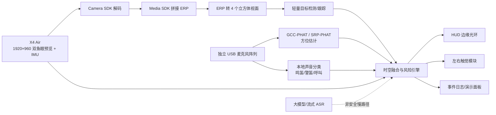

# Halo 360（声环）——把环境声音变成可行动的视觉方向

> 面向听障骑手的 360° 多模态安全辅助系统。X4 Air 看见四周，独立麦克风阵列定位声音，边缘 HUD 与左右触觉把“什么声音、从哪来、是否危险”在一秒内告诉用户。

## 1. 产品判断

### 为什么值得做

- 与命题高度吻合：不是让用户操作相机，而是让相机理解环境并主动服务人。
- 全景相机解决普通眼镜相机看不到身后与侧后的问题；X4 Air 的实时预览与 IMU 数据能支撑 360° 视觉和方向稳定。
- 听障用户确实需要“声源是什么 + 在哪里”。既有研究已验证手表声音识别、AR 字幕和头显声源方向提示的价值。
- 演示性强：让评委戴上设备，背后鸣笛，HUD 在正确方位亮起，3 秒即可理解产品。

### 当前想法必须修正的四点

1. **目标人群过宽。** 听障人士、骑手和工人不能同时做成首发产品。比赛主场景锁定“听障骑手”，工地模式放在扩展页。
2. **持续环形声纹会造成视觉噪声。** 环只作为空间坐标，平时不可见；事件出现时只亮对应扇区，并显示类别与紧迫度。
3. **平面阵列不能可靠判断上下。** MVP 只承诺水平 8 方位。上下信息仅在视觉确认或非共面阵列置信度足够时显示为顶部/底部小菱形，不做连续三维三棱锥。
4. **安全判断不能依赖大模型或网络。** 本地小模型负责低延迟危险告警；大模型只负责字幕、语义解释和赛后摘要。

## 2. 一句话方案与首发场景

**Halo 360 = 360° 视觉 + 空间音频 + 本地 AI，将不可见的声音转译成方向、类别、风险和行动提示。**

首发演示只讲一个故事：

1. 骑手正常前行，HUD 中央 70% 无覆盖。
2. 左后方车辆鸣笛，麦克风阵列估计方位；X4 Air 在相同角度发现接近车辆。
3. 左后边缘出现红橙扇区和“汽车鸣笛 · 左后”，左侧触觉短振两次。
4. 用户回头或车辆风险解除后，提示自动淡出。
5. 前右方有人说“师傅，小心”，以青色方向箭头和短字幕出现，但优先级低于车辆危险。

## 3. 交互规范

### 信息编码

| 维度 | 表达方式 | 规则 |
|---|---|---|
| 方向 | 视野边缘对应位置 | 水平分 8 个扇区；不在中央画雷达 |
| 类别 | 图标 + 最多 8 个中文字符 | 如“鸣笛”“警笛”“有人呼叫” |
| 紧迫度 | 颜色 + 形状 + 动效 | 红橙=立即处理，琥珀=注意，青色=交流；不能只靠颜色 |
| 置信度 | 透明度 | 低置信度不显示百分比，不打扰用户 |
| 左右触觉 | 左/右太阳穴振动 | 危险声才触发；后方为两次短振，正侧方为一次长振 |
| 上下方向 | 顶部/底部小菱形 | 仅置信度高时出现；MVP 可不启用 |

### 告警优先级

1. **P0 立即危险：** 汽车鸣笛、警笛、倒车蜂鸣、火警；红橙 + 触觉，保持 1.2 秒，风险未解除可续期。
2. **P1 需要注意：** 自行车铃、施工敲击、有人大声喊；琥珀，无连续震动。
3. **P2 交流：** 对话与关键词字幕；青色，危险事件出现时立即让位。

加入 300ms 方位平滑、15° 滞回和 1.2 秒视觉保持，避免方向在相邻扇区来回抖动。

## 4. 可实现的系统架构

### 数据与融合规则

- X4 Air 走 USB，桌面端切“安卓模式”，供电满足 5V/3A；Camera SDK 获取 H.264/H.265 双鱼眼流和 `OnGyroData`。
- 预览分辨率用官方建议的 1920×960，不上 5.7K，降低双路解码、拼接与推理压力。
- 麦克风阵列独立 USB 接入计算端，因为普通预览无音频；GO 3S 也无法通过 SDK 取音频。
- 音频事件得到 `(类别, 方位角, 置信度, 时间戳)`；视觉目标得到 `(类别, 球面方位角, 运动方向, 时间戳)`。
- 当音频和视觉角度差小于 25°、时间差小于 500ms 时建立关联。
- 建议风险分：`0.45×声音置信度 + 0.35×视听方向一致性 + 0.20×接近趋势/TTC`。
- 相机 IMU 与帧必须同步，用于把目标稳定在世界方向，减少用户转头时的 HUD 漂移。

### 模型与工程选型

| 模块 | 48 小时推荐 | 后续升级 |
|---|---|---|
| 声源方位 | 单主声源 GCC-PHAT + 中值滤波 | ODAS / SRP-PHAT，多声源跟踪 |
| 声音分类 | YAMNet/TFLite，补录少量赛事现场样本 | BEATs/PANNs 微调与个性化声音 |
| 视觉检测 | YOLOv8n/同级轻量模型，4 个立方体视面 | 全景原生检测、深度与 TTC |
| 中文语音 | 流式 ASR，只用于呼叫/字幕 | 说话人识别与个性词库 |
| 大模型 | 仅解释“刚才发生了什么” | 多模态场景理解；不进入安全闭环 |
| 输出 | 笔记本/Android 上渲染 HUD，再投屏到眼镜 | 真正光学透视 AR 眼镜或量产头盔 HUD |

## 5. 硬件选型与设备分工

### 黑客松 MVP

- **主相机：X4 Air。** 负责 360° 实时预览、视觉目标与 IMU 姿态。
- **麦克风：现成 4/6 麦 USB 环形阵列。** 先实现水平 8 方位。不要在比赛现场从零焊非共面阵列。
- **计算：带 NVIDIA GPU 的 Windows/Linux 笔记本，放背包或桌面。** 这是最稳的演示路径；Media SDK 桌面端需要 GPU。
- **显示：能作为外接屏的 AR 眼镜优先；没有则用透明亚克力 HUD/手机屏做视野模拟。** Antigravity 头显只做形态参考，除非现场确认开放视频输入或 SDK。
- **触觉：两个 ESP32 控制的硬币马达，左右各一个。** 由主程序通过 BLE/串口触发。
- **GO 3S：可选。** 用作工地胸前/工具端平面第二视角或拍演示素材，不进入主安全闭环。

### 量产方向

- X4 Air 级全景视觉与浅四面体 MEMS 阵列共轴封装，减少视觉/音频坐标标定误差。
- 计算单元与电池后置，平衡头盔前后重量；摄像与麦克风模块快拆。
- 左右触觉内置于头盔衬垫；HUD 只显示边缘事件。

## 6. 48 小时执行排期

| 时间 | 目标 | 交付物 |
|---|---|---|
| 0–4h | 跑通硬件与 SDK | X4 Air USB 实时帧、IMU 日志、麦阵多通道录音 |
| 4–10h | 做出声音方向 | 4/8 方位可视化；单声源角误差统计 |
| 10–16h | 做出声音类别 | 鸣笛、警笛、呼叫三类；置信度与去抖 |
| 16–24h | 打通全景视觉 | 1920×960 预览、Media SDK 拼接、车辆/行人检测 |
| 24–32h | 视听融合 | 音频角度与视觉目标关联，输出统一事件 JSON |
| 32–38h | HUD 与触觉 | 方向光环、优先级抢占、左右振动 |
| 38–43h | 现场测试 | 8 方位 × 3 类声音 × 5 次，记录延迟/误差/漏报 |
| 43–48h | 演示与答辩 | 90 秒现场演示、3 分钟讲稿、失败降级视频 |

### 四人分工

- A：X4 Air SDK、解码、Media SDK、IMU 同步。
- B：麦克风阵列、GCC-PHAT、声音分类。
- C：视觉检测、视听融合、风险引擎。
- D：HUD/触觉、用户测试、演示与答辩。

三人队时，C 与 D 合并；不要牺牲音频方向和演示稳定性去做后台、账号、云端管理。

## 7. 可验收指标

比赛前至少输出一张实测表，而不是只说“有效”。

| 指标 | 通过线 | 冲刺线 |
|---|---:|---:|
| 危险声音召回率 | ≥85% | ≥92% |
| 水平方位中位误差 | ≤22.5° | ≤15° |
| 端到端 P95 延迟 | ≤900ms | ≤600ms |
| 安静道路误报 | ≤1 次/5 分钟 | ≤1 次/10 分钟 |
| 用户转向正确率 | ≥85% | ≥95% |
| HUD 中央无遮挡区域 | ≥70% | ≥80% |

测试最小集：8 个方向 × 3 类声音 × 5 次，安静/交通噪声两个条件；另外单独跑 10 分钟负样本。记录原始音频、预测角度、视觉目标、最终事件和时间戳，便于现场复盘。

## 8. 风险与降级

| 风险 | 影响 | 降级策略 |
|---|---|---|
| Media SDK 拼接延迟或 GPU 兼容问题 | 视觉链路卡住 | 保留音频方向主路径；视觉改用单鱼眼/预录全景流 |
| 麦阵在反射环境角度跳动 | 提示抖动 | 单声源演示、限 8 扇区、中值滤波与滞回 |
| 多声源同时出现 | 分类与方位错配 | 只显示最高风险事件，其他事件进入队列 |
| AR 眼镜无开放输入/SDK | 无法真机叠加 | 用透明 HUD 样机或手机第一视角渲染，展示同一 UI |
| 大模型/网络慢 | 安全告警延迟 | 大模型完全退出 P0/P1 回路，只保留事后解释 |
| 上下定位不可靠 | 误导用户 | MVP 关闭垂直提示；量产版再上非共面阵列 |

## 9. 三个摄影博主访谈问题

赛事资源要求每组完成 3 人次访谈，建议把访谈用于验证“相机怎么装、什么场景最容易失效”，不要问泛泛的喜好：

1. 骑行与工地场景中，X4 Air 放在头顶、头后还是肩部，哪个位置最不易被头盔、身体和配件遮挡或落在拼接缝？
2. 夜间车灯、逆光和高振动下，什么分辨率、快门、ISO 与固定方式最适合实时目标检测？
3. 如果最终视频只允许保留一种提示，摄影者认为“方向、类别、危险级别、距离”哪项最应该留？为什么？
4. 请其现场指出一个会误导算法的场景，并让团队录下失败样本。

每次访谈保留一句可引用结论和一段 10 秒现场验证视频，答辩时展示“我们根据 3 位创作者反馈改了什么”。

## 10. 三分钟答辩结构

1. **0:00–0:20 痛点：** 对听障骑手而言，车后的鸣笛不是声音问题，而是来不及转头的安全问题。
2. **0:20–0:40 定义：** Halo 360 不放大声音，而是把声音变成可行动的方向。
3. **0:40–1:40 现场演示：** 左后鸣笛 → 红橙扇区 + 左侧触觉；前右呼叫 → 青色字幕；同时出现时危险告警抢占。
4. **1:40–2:20 技术：** X4 Air 360° 视觉与 IMU、独立麦阵、时空融合、本地快路径。
5. **2:20–2:45 数据：** 展示方位误差、P95 延迟、召回率和误报率。
6. **2:45–3:00 延展：** 同一系统切换工地模式，识别倒车蜂鸣、火警和同事呼叫。

建议结尾：**“不是让听障用户看见所有声音，而是让他们在最需要的一秒，看见该行动的声音。”**

## 11. 已核对的资料与边界

- [赛事 SDK 与开源算法指南](https://arashivision.feishu.cn/wiki/YfiOwnwLeivnB3k2vJycWwyLnxc)：X 系列 Camera/Media SDK、实时双鱼眼预览、1920×960 推荐预览、IMU、普通预览音频限制、桌面 Media SDK 的 GPU 要求。
- [Insta360 SDK Guide](https://onlinemanual.insta360.com/developer/en-us/resource/sdk)：X4 Air 支持二次开发；Camera SDK 支持预览流，Media SDK 支持拼接与导出。
- [Insta360 Integration Guide](https://onlinemanual.insta360.com/developer/en-us/resource/integration)：SDK 可获取实时画面；预览流需解码处理。
- [X4 Air 麦克风连接说明](https://onlinemanual.insta360.com/x4air/en-us/operating-tutorials/connect/microphone)：外接麦克风支持并不等于多通道空间阵列；单蓝牙设备与音频模式有约束。
- [GO 3S 外接设备说明](https://onlinemanual.insta360.com/go3s/en-us/faq/compatibility/external)：GO 3S 不支持外接麦克风或蓝牙耳机，因此不作为主空间音频入口。
- [GlassEar / CHI 2015](https://makeabilitylab.cs.washington.edu/project/glassear/)：听障参与者认为“谁在说话/声音来自哪里”有价值，支持头显方向可视化的产品方向。
- [SoundWatch](https://makeabilitylab.cs.washington.edu/project/soundwatch/)：可穿戴端的环境声音识别已有用户研究与技术验证。
- [2025 AR 眼镜方向语音研究](https://www.jstage.jst.go.jp/article/comex/14/7/14_2025XBL0042/_article/-char/en)：将语音方向、识别结果与说话人信息显示在 AR 眼镜上的系统和评估。

## 12. 明天开工前的 Go / No-Go

开工 4 小时后必须检查三件事：

- X4 Air 能否稳定输出 1920×960 预览并拿到 IMU；
- 麦克风阵列能否稳定读到多通道数据并区分左/右/后；
- HUD 输出设备是否能接收你们的画面。

三项中有两项失败，就立刻切换为“预录全景 + 实时音频方向 + 屏幕 HUD”的可控演示，不再赌硬件集成。
