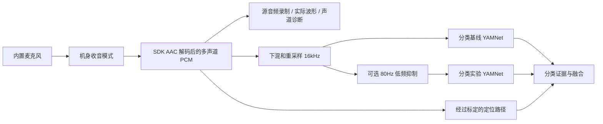

# 降噪、声音分类与方向定位

更新：2026-09-23。用户确认当前为 **X4 Air 内置麦克风、智能降风噪-强**，机身另有立体声、全景声选项。已记录到本机配置；软件额外降噪默认关闭。

后续实机对照：用户切换全景声并重连后，SDK 已测得 **48kHz 四声道**，四路不是重复数据，约 30 FPS 实时视频正常。当前配置记录为全景声；仍须完成四方位及转动标定才启用声源方向。此前强降风噪基线保留。

## 设计目标

降噪的验收目标是改善嘈杂环境下的危险声音识别，同时保持可验证的方位信息。听感更干净、模型置信度变高、底噪变小，都不能单独当作召回率或定位提升的证据。

必须区分机身处理和软件处理：SDK 回调已经可能经过相机降噪、混音和 AAC 编码。项目保存的“源音频”指 **SDK 解码后、软件额外处理前** 的 PCM，不等于传感器原始信号。软件无法恢复上游已丢失的空间信息。



## 已实现的策略

- 机身模式分别记录强降风噪、弱降风噪、立体声、全景声、人声增强；旧 `wind_reduction` 保留为“强度未记录”，不能自动当成强档。麦克风类型单独记录。网页设置不遥控机身。
- 软件默认 `audio_preprocessing=off`，不叠加分类滤波。2026-09-23 已从强降风噪切换全景声以验证定位；分类额外处理仍关闭。
- 实验项 `lowcut_80hz` 为 16kHz 分类副本上的二阶 Butterworth 高通，截止频率 80Hz，保留跨块状态；不会增加前视缓冲，但仍有滤波相位响应和额外计算成本。它仅衰减低频，不能代表完整风噪消除。
- 实验开启时分别执行基线和滤波副本的 YAMNet，逐类别取两者较大分数，并沿用阈值和去抖。此规则不以滤波结果否决基线，**也不能用于声称误报降低**；额外分支可能增加误报或处理延迟，必须实测。额外推理失败时保留基线并报告错误。
- 录制、实际波形和声道相关性使用软件处理前的源音频。定位由源 PCM 的独立副本计算，对四个声道统一施加二阶 80–4000Hz 带通，丢弃每个分析窗口起始 20ms 瞬态；标定、转动验证及实时 300ms 窗口使用同一路径。该固定频段来自本轮诊断，不逐方位择优、不拟合角度修正表；不降低原置信度阈值 0.2。滤波结果不写回源 PCM，不使用独立声道自适应降噪。
- 通过四方位和转动验证后，YAMNet 使用已验证的 W 全向声道；直接平均 W/X/Y/Z 可能抵消部分声源。未通过验证时仍为普通下混。分类副本的可选低频抑制不影响定位路径。
- 导出的声音诊断包含机身模式、麦克风类型、软件处理策略及两路分类分数。录制保存配置和音频所处处理阶段；回放遵从录制时的设置，旧录制缺少设置时仍为“未确认/关闭额外处理”，不能套用当前强降噪设置。
- 定位标定绑定相机序列号、机身模式、麦克风类型、采样率、声道数及算法版本；不匹配时禁止复用。原始四方位采样可恢复；失败不会丢弃已采样数据，失败转动测试会撤销旧验证。双声道同源时不尝试生成音频方位；存在唯一合适的视觉目标时仍可提供明确标记的视觉候选方向。
- 声道映射验证与方位精度分开：每个方位都需满足误差 ≤22.5°、置信度 ≥0.2，并通过独立转动记录，才可输出音频方位。平均误差不能掩盖单方向超标。未达到精度门槛时，已验证的 W 通道仍用于分类；详见 [误差复查](../reports/spatial-accuracy-review.md)。

## 机身模式对照流程

1. 固定相机位置、声源位置、距离、播放设备、音量和 USB 直播参数。先录安静环境，再录一致的风噪/背景噪声条件，记录环境条件，不能让模式和噪声条件同时变化。
2. 依次测试强降风噪、弱降风噪、立体声、全景声。每次停止取流、手动改机身设置，在网页记录对应模式后重连；导出诊断并录制。记录声道数、布局、相关性、差异能量、缺帧/音频中断。若输入仍为同源双声道，记录定位不可用。
3. 只有输出提供候选空间信息时才继续四方位与转动标定，不能以“全景声”名称直接宣告有实时 Ambisonic。
4. 对每份相同录制运行额外处理关闭/低频抑制两种软件策略，独立于机身模式比较。鸣笛、警笛、铃声、喊声、人声均须覆盖，避免只用语音质量评价整个系统。
5. 对选定组合完成原方案的 240 次标注实测及 10 分钟负样本；报告召回率、误报、方向覆盖率和误差、端到端 P95 与算法处理耗时。输入方向不可用、未知方向和失败样本不能排除。

手动确认机身模式并停止网页采集后，可以用以下探测脚本自动标记模式、采集 10 秒、保存 PCM 和诊断，结束时释放相机。`--profile` 只是对已完成的机身操作作记录，不会遥控切换：

```powershell
.venv\Scripts\python.exe scripts/camera_audio_probe.py --profile ambisonic --microphone builtin --seconds 10
# 其他可对照的机身模式：wind_reduction_strong / wind_reduction_weak / stereo
```

该脚本会把额外软件处理设为关闭，以便比较机身输出；收音必须来自相机，电脑麦克风备用不能充当该机身模式的结果。

| 对比项 | 当前证据 | 仍需完成 |
|---|---|---|
| 内置麦克风 + 强降风噪 | 用户确认设置后，已重新连接并录制：48kHz、双声道同源，相关性 1.0，差异能量比 0.0 | 与其他模式在同条件下的对照，不能由现象直接推断强降风噪是同源原因 |
| 全景声 | 实测 SDK 直播输出 48kHz 四声道，四路不重复；已完成四方位与转动验证，并复查首轮 32–33° 偏差，见 [误差复查](../reports/spatial-accuracy-review.md) | 当前标定最大误差 16°，仍需完整方位精度、方向覆盖率、危险声音识别及噪声条件性能验收 |
| 弱降风噪 / 立体声 | 机身存在相应选项，官方说明支持这些模式 | 分别验证 SDK 直播实际输出；暂无逐模式数据 |
| 软件 80Hz 低频抑制 | 可关闭的实验已实现，信号处理和基线保留自动测试通过 | 风噪条件下的分类收益、误报和额外耗时 |

离线对比工具（需要已有录制和本机模型，不使用相机）：

```powershell
.venv\Scripts\python.exe scripts/audio_ab_check.py --session 20260922-225114 --seconds 10
```

输出 `reports/local-audio-ab.json`：逐窗口基线/滤波分数、超过记录阈值的窗口数及双分支推理 P95。没有标注时明确 `accuracy_measured=false`；窗口数不是独立事件数，分数变化不等于收益。

本次实际检查见 [降噪工程验证](../reports/audio-noise-validation.md)。

## 依据与待验证假设

官方说明 X4 Air 支持强/弱自动降风噪、立体声、人声增强和 360 音频；360 音频仅用于全景视频录制。它没有保证当前 SDK 直播交付同样的空间声道。[官方音频说明](https://onlinemanual.insta360.com/x4air/en-us/operating-tutorials/step/audio)

滤波采用 SciPy 的 SOS 系数和跨块滤波状态。[Butterworth 设计](https://docs.scipy.org/doc/scipy/reference/generated/scipy.signal.butter.html)、[SOS 状态滤波](https://docs.scipy.org/doc/scipy/reference/generated/scipy.signal.sosfilt.html)

“机身强降风噪可能改变空间线索”是需要对照实验的风险假设，不是本次已证实的原因。当前不承诺开启全景声后直播方向必然恢复，也不承诺额外软件降噪一定提升危险声音识别。
